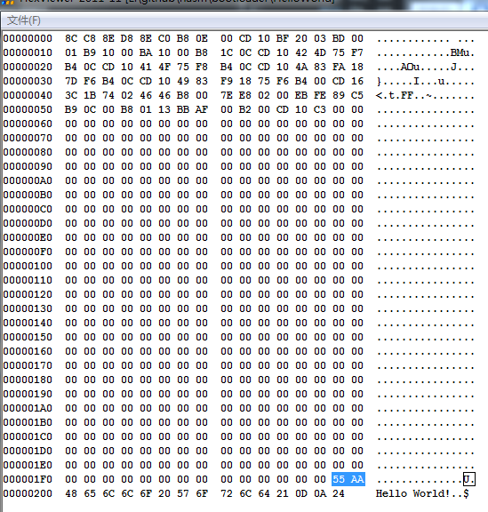
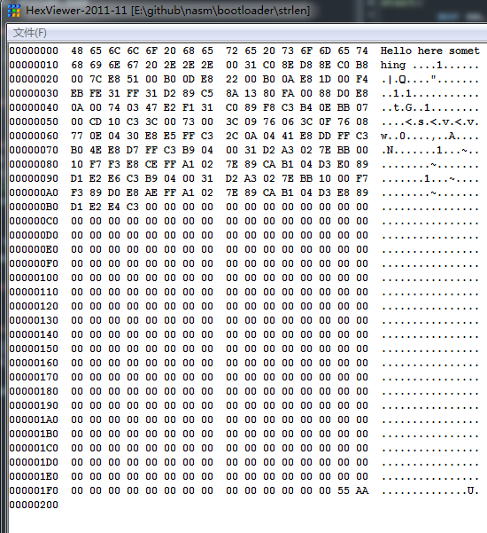
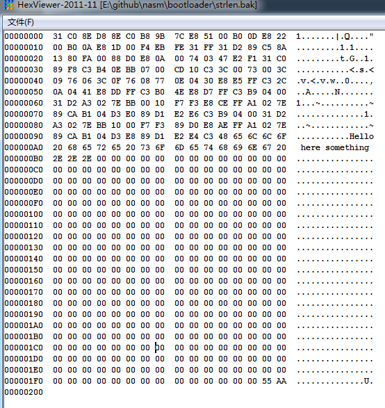

QA
=====

本文档记录使用过程中的一些心得，以及一些问题，包括对问题的跟踪结果。

## File Extension
- bootloader：`*.bin`
- vdosbox：`*.com`

## Q&A
Q1：之前发现 vbox 和 dosbox 中效果不一样，有时候某些程序在 dosbox 中运行正常，而在 Virtualbox 中运行异常。
A：因为编译的 bootloader 大小不符合 512 字节，目前看到的问题文件都是大于 512 字节。
- 字符串部分在 512 字节以外（这导致字符串处理的部分，结果不符合预期）
- 或者 55aa 标志在 512 字节以外(这会导致开机执行不了)
这部分内容不会被当成 mbr 加载进内存，所以程序运行会有问题。而 DOS 的 com 文件则没这个限制。

Q2：接上。
- 发现只要包含 section .data，编译的结果就会大于 512 字节。
- 如果，不使用 .data，仅包含 .text 没有问题。
- 包含 .bss 也没有问题
- 未比对是否位系统不一样，或者 nasm 版本不同导致的。
- 更新-1: 使用最新版 2.11.08 测试过，仍然是大于 512 字节
- 所以，对于 bootloader 程序，需要检查编译结果的大小，以及使用 HexViewer 查看十六进制内容。



Q3: （实模式，binary 格式）
- 因为不能使用 section .data, 所以如果将 data 部分的内容，放在 asm 文件的首部，那么程序加载的时候，第一条指令其实是我们定义的初始化数据，会导致不可预期的结果。
- 这个可以对比生成的目标文件的二进制内容。
- 所以，应该将 data 部分放在程序的尾部(以 0 填充的区域的前面)，以防止处理器执行到数据部分。





## Notes
### $
表示当前指令所在的地址

### $$
表示当前 `section` 的首地址

### .bss
由于 `.bss` 的特殊性，它只是相当于一个声明，所以 **不影响最后的目标文件的大小**。

`binary格式`
据目前的理解，编译器会顺序将每个section翻译成机器码，他们是顺序在目标文件中排列下去。

回到源程序，bootloader 程序最后一般会使用

``` asm
times (512-($-$$) - 2)	db 0
db 0x55, 0xAA
```

来进行目标文件的填充，以保证目标文件大小为 512 字节

如果，源码中包含多于 1 个的 section，那么上述填充 0 的部分，会算在离他最近的那个 section，`$$` 也会等价于该 section 的起始地址

举例，示例源码如下

```
section a
section b
section c
times (512-($-$$) - 2)	db 0
db 0x55, 0xAA
```

此时，`$` 表示的是当前的这条指令的地址，`$$`表示 section c 的地址；

那么 `(512-($-$$) - 2)` 没有将 a 和 b 算在内，正确的算法应该是
`(512-($-section a地址) - 2`

上述错误的写法，最终文件大小应该是 (512 + section a 的大小 + section b) 的大小；
